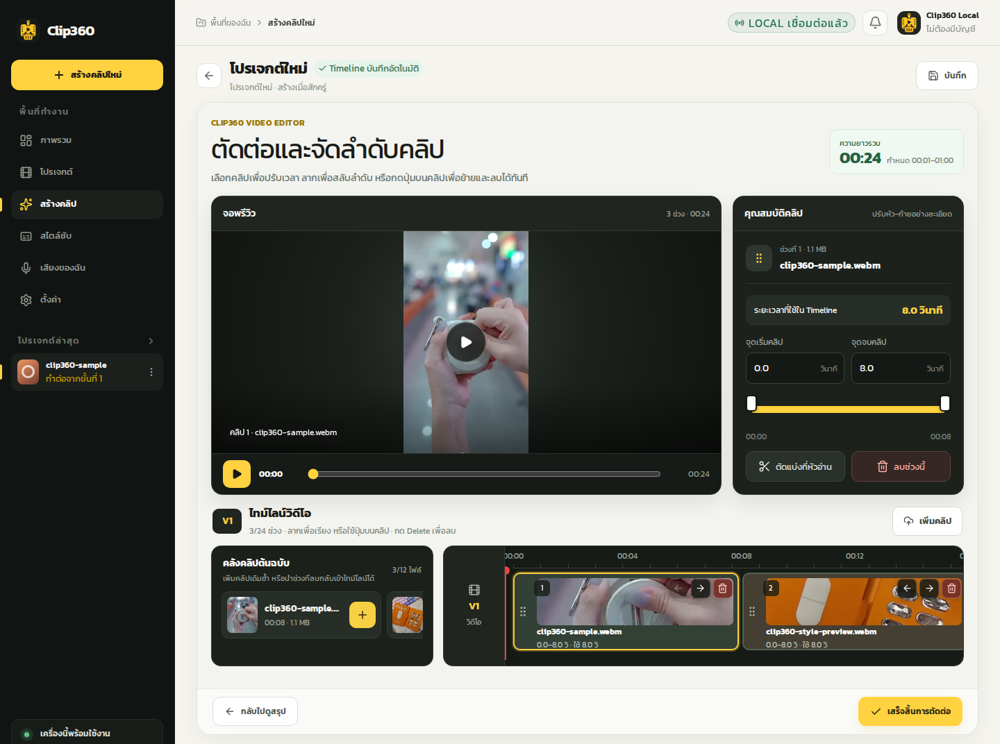
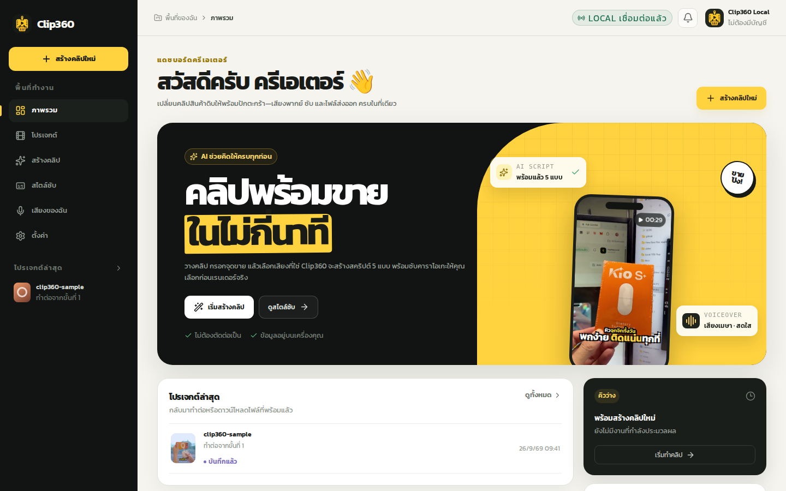
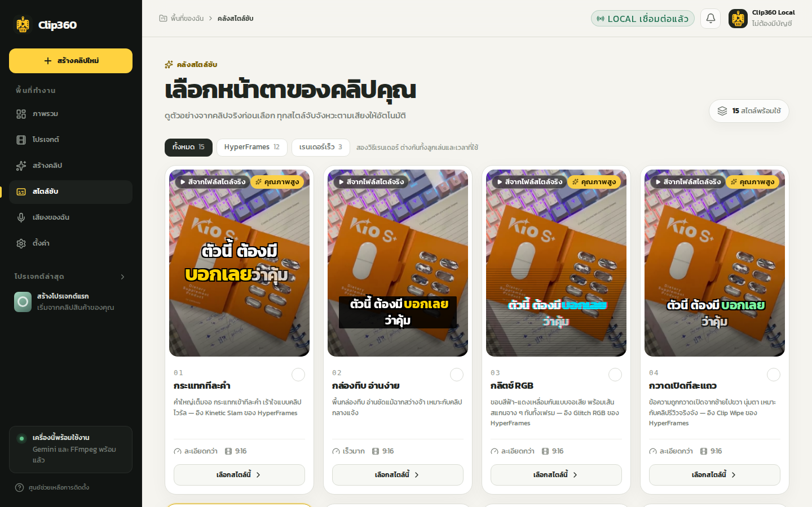

# Clip360

**เปลี่ยนคลิปสินค้าดิบเป็นวิดีโอแนวตั้งพร้อมขาย บนเครื่องของคุณเอง** 
วางคลิป → ตัดต่อบน Timeline → AI ช่วยเขียนสคริปต์ → พากย์เสียงไทย + ซับตามคำพูด → ได้ MP4 พร้อมโพสต์

Windows 10/11 · ไฟล์ประมาณ 150 MB · ลิงก์นี้ได้เวอร์ชันล่าสุดเสมอ · แอปอัปเดตตัวเองเมื่อมีเวอร์ชันใหม่ · <a href="https://github.com/Work360team/Clip360/releases">ดูทุกเวอร์ชัน</a>

> [!TIP]
> **เปิดไฟล์ครั้งแรก** ถ้าขึ้นกล่องสีฟ้า "Windows protected your PC" ให้ตรวจว่าดาวน์โหลดจาก `github.com/Work360team/Clip360` แล้วกด **More info** → **Run anyway**
> ขึ้นแค่ครั้งแรก เพราะไฟล์ยังไม่ได้ลงทะเบียนชื่อผู้พัฒนากับ Microsoft

## เริ่มใช้ใน 3 ขั้น

1. **ดาวน์โหลดแล้วดับเบิลคลิก** `Clip360-Setup.exe` แอปติดตั้งแล้วเปิดขึ้นมาเอง ไม่ต้องใช้รหัส admin
2. **ทำตามหน้าตั้งค่าครั้งแรก** กดติดตั้ง FFmpeg แล้ววาง Gemini API key ที่ขอฟรีได้จาก [Google AI Studio](https://aistudio.google.com/app/apikey)
3. **กด สร้างคลิปใหม่ แล้วลากคลิปสินค้ามาวาง** ตัดต่อ กรอกจุดขาย เลือกเสียง สคริปต์ และสไตล์ซับ แล้วกดสร้างคลิป

## รุ่นฟรีและผู้เรียนคอร์ส

| | รุ่นฟรี | ผู้เรียนคอร์ส Skill360 |
|---|---|---|
| คลิปต่อวัน | 3 | ไม่จำกัด |
| สไตล์ซับ | 3 แบบ | ครบ 15 แบบ |
| เสียงของฉัน (อัดเสียงตัวเองแล้วให้พากย์แทน) | — | ✓ |
| Timeline, สคริปต์ AI, เสียงพากย์ไทย 30 เสียง, แคปชันโพสต์ | ✓ | ✓ |
| ลายน้ำ | ไม่มี | ไม่มี |

ผู้ซื้อคอร์สได้ **คีย์ผู้เรียน** ในอีเมลยืนยันการซื้อ วางในหน้า **ตั้งค่า → คีย์ผู้เรียนคอร์ส** ครั้งเดียว ใช้ได้ตลอดชีพ ไม่มีค่ารายเดือน · [ดูคอร์สบน Skill360](https://skill360.co)

ค่าใช้จ่าย AI (ถ้ามี) เป็นของบัญชี Google ของคุณเอง ใช้ free tier ของ Gemini ได้

<table>
  <tr>
    <td width="50%"></td>
    <td width="50%"></td>
  </tr>
</table>

## ข้อมูลอยู่บนเครื่องคุณ

คลิปและไฟล์ผลลัพธ์ไม่ถูกอัปโหลดออกไป ข้อความสินค้าและสคริปต์ถูกส่งไปยังผู้ให้บริการ AI ที่คุณเลือกเท่านั้น แอปไม่มี telemetry
ข้อมูลทั้งหมดอยู่ที่ `%LOCALAPPDATA%\Clip360` ถอนการติดตั้งแล้วงานเดิมยังอยู่

## เงื่อนไขการใช้งาน

- ใช้ Clip360 ทำคลิปของตัวเองได้ ทั้งส่วนตัวและเชิงพาณิชย์ คลิปที่สร้างเป็นของคุณ
- ห้ามแก้ไข ถอดรหัส หรือนำตัวโปรแกรมไปแจกจ่ายหรือขายต่อ ห้ามแจกคีย์ผู้เรียนให้ผู้อื่น
- ให้บริการตามสภาพ (as is) โดยไม่มีการรับประกัน

repo นี้มีแค่ไฟล์ติดตั้ง ซอร์สโค้ดของ Clip360 ไม่ได้เปิดสาธารณะ · © Work360
